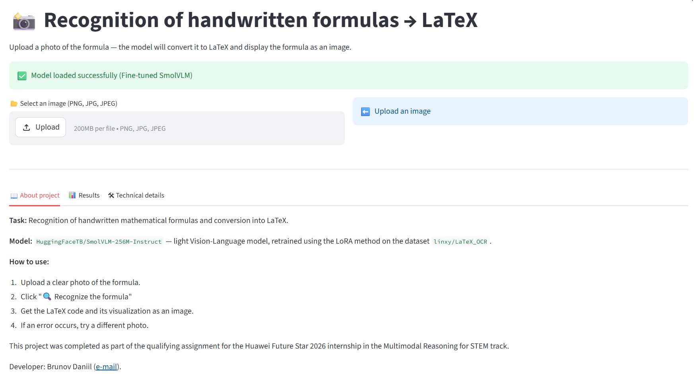
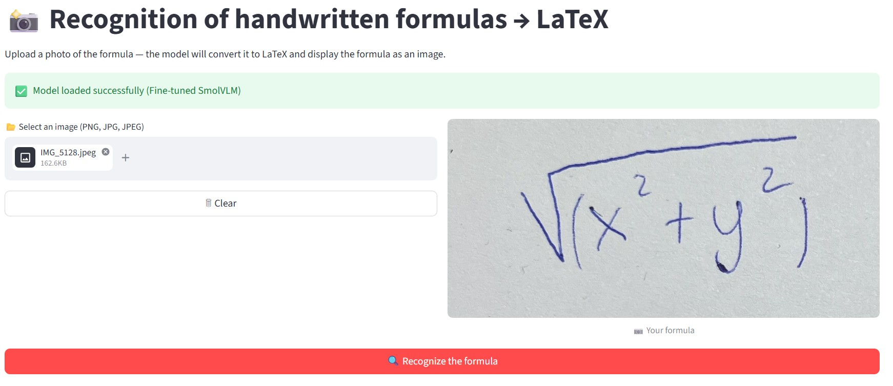
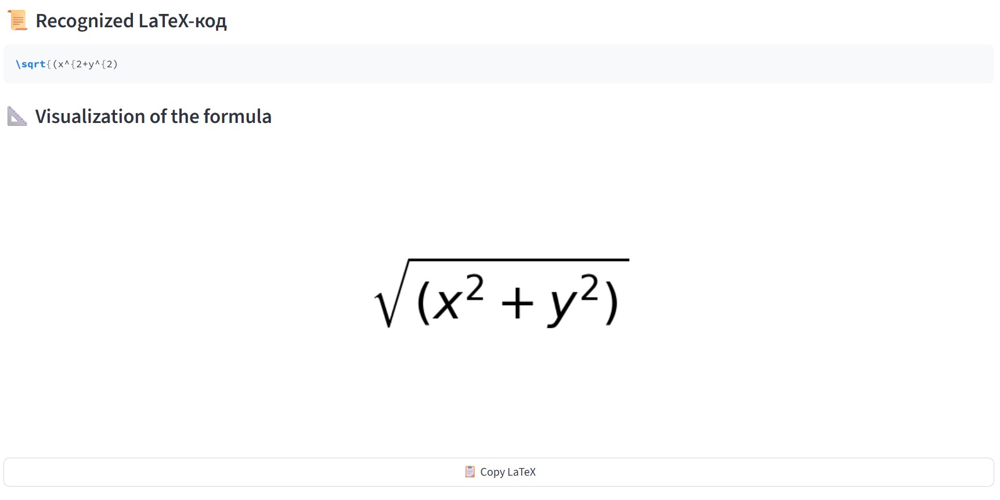

# Recognizing Handwritten Mathematical Formulas in LaTeX

## 📌 Project Description

This project was completed as part of the qualifying assignment for the **Huawei Future Star 2026** internship in the **Multimodal Reasoning for STEM** track.
The goal is to further train the Vision-Language model to convert images of handwritten formulas into LaTeX code and create a web application for demonstration.

## 🧠 Model Used

- **Architecture:** `HuggingFaceTB/SmolVLM-256M-Instruct` (lightweight VLM)
- **Training Method:** LoRA (Low-Rank Adaptation) with parameters:
- `r = 8`
- `lora_alpha = 16`
- `target_modules = ["q_proj", "v_proj"]`
- **Optimizer:** AdamW, learning rate = 2e-4
- **Number of Epochs:** 3
- **Batch Size:** 1 (with 4-step gradient accumulation, effective batch = 4)
- **Accuracy:** FP16 (mixed precision)

## 📊 Data

- **Training dataset:** `linxy/LaTeX_OCR` (configuration `small`)
- **Test dataset:** 30 examples from `linxy/LaTeX_OCR/small`
- **Validation:** Exact Match and BLEU-4 (symbol level) metrics

*The choice of data is dictated by hardware limitations.*

## 📈 Results

| Method | Exact Match (%) | BLEU-4 |
|-------|----------------|--------|
| Zero-shot | 0.00% | 0.2625 |
| One-shot | 0.00% | 0.1209 |
| Fine-tuned (SFT) | 0.0% | 0.2441 |

> SFT even slightly worsened the quality: BLEU dropped slightly compared to zero-shot.

## 🖥️ web application

Developed with **Streamlit**. Features:
- Formula image loading (PNG, JPG)
- Recognition using a trained model
- LaTeX code display and visualization (matplotlib)
- Tabs with project description, results table, and technical details
- Error handling (LaTeX validation check)

### Screenshots of the application in action





> Screenshots are located in the `screenshots/` folder of the repository.

## 📦 Repository Structure
```
├── train_one.py # Script for SFT on a single dataset
├── evaluate.py # Zero-shot / one-shot evaluation
├── eval_trained.py # Evaluation of the trained model
├── evaluate_final.py # Evaluation mix final
├── app.py # Streamlit application
├── requirements.txt # Dependencies
├── README.md # This file
├── screenshots/ # Folder with screenshots
│ ├── load_image.jpg
│ ├── predict.jpg
│ └── start_page.jpg
└── report.md # report about work
```

## 🔗 Model Link

The trained model is available at this link:  
[Hugging Face](https://huggingface.co/danilb575/Case_10_model)

> The archive with the checkpoint is also available at [link to Google Drive](https://drive.google.com/drive/folders/1gZL4MaXLi-B4NrK8TgpAt2b1H6okuynx?usp=sharing).

## 🚀 Launch

1. Clone the repository
2. Install dependencies: `pip install -r requirements.txt`
3. Place the `model_latex_only/final` folder in the project root
4. Run the application: `streamlit run app.py`

## 📝 Notes

- Training was performed on an NVIDIA GPU (CUDA). Training will be slow on a CPU.
- Visualizing formulas via matplotlib requires LaTeX (dvipng) to be installed. If LaTeX is not installed, only the code is displayed.
- The model may fail on very complex or unclear formulas; the application handles these cases.
